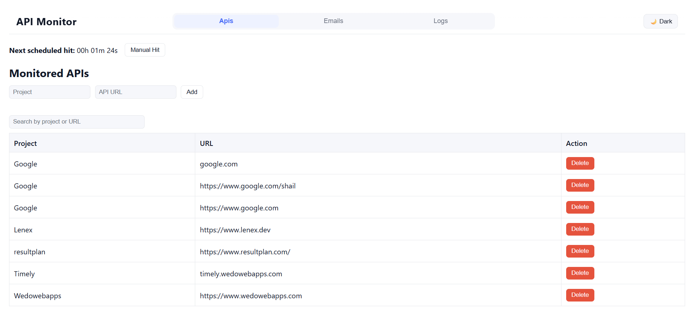
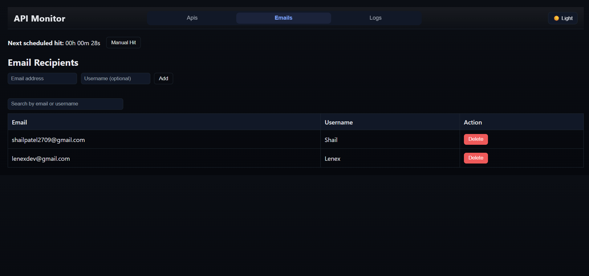
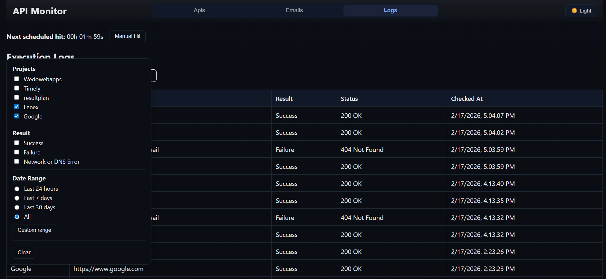

# 🚨 API Monitor & Alert System

A production-style API monitoring platform that periodically checks registered APIs, logs results, and sends email alerts on failures.

Built with a React (Vite) dashboard, Express + TypeScript backend, MySQL, BullMQ, and Redis, featuring reliable scheduling, retry mechanisms, and a modern responsive UI.

---

## ✨ Key Features
### 🔍 Monitoring & Scheduling

- Monitor unlimited APIs at fixed intervals (BullMQ repeatable jobs)
- Live “Next scheduled hit” ETA (updates every second)
- Manual Hit button to run checks instantly
- Scheduler resets automatically when APIs are added/removed
- No cron dependency — fully Redis + BullMQ based

### 📊 Logging & Filtering

- Persistent execution logs stored in MySQL
- Advanced log filtering:
- Project
- Result type (Success / Failure / Network error)
- Date presets + custom range
- Search across project, URL, status, and result
- Sortable table headers
- Incremental loading:
- Load 100 by default
- +10 / +100 / View All

### 📧 Alerts & Reliability

- Email alerts on API failure
- Retry logic with fixed backoff
- Guaranteed no duplicate emails
- Separate workers for monitoring and email retries

### 🎨 UI & UX

- Clean, modern light & dark themes
- Sticky responsive navbar
- Theme toggle (persistent across pages)
- Overlay-based filters (no layout shift)
- Click-outside to close filter panels
- Fully responsive (desktop → mobile)

---

## 🖼️ Screenshots





---

## 🏗️ Architecture Overview

<pre>
React (Vite)
↓ HTTP
Express API (Node.js)
↓
MySQL (logs, monitored_apis, emails)
↓
BullMQ (monitor queue, email-retry queue)
↓
Redis
↓
Background Workers
</pre>

---

## 🗂️ Project Structure

<pre>
project/
├── api-monitor-ui/        # React frontend (Vite)
│   ├── src/
│   │   ├── pages/
│   │   ├── components/
│   │   └── styles/
├── src/
│   ├── routes/            # Express routes
│   ├── workers/           # BullMQ workers
│   ├── queue/             # Queues + scheduler
│   ├── services/          # API check logic
│   ├── database.ts        # MySQL access layer
│   ├── email.ts           # Email service
│   ├── scheduler.ts       # Initial scheduler
│   ├── rescheduleMonitor.ts
│   └── cleanup.ts         # Removes old repeat jobs
├── dist/                  # Compiled output
├── package.json
└── README.md

</pre>

---

## 🧠 Core Concepts Used

- BullMQ repeatable jobs for scheduling (no cron dependency)
- Redis-backed retry queues for email delivery
- Worker separation (monitor worker & email worker)
- Idempotent scheduling (cleanup script prevents duplicates)
- Safe job IDs (hashed to avoid BullMQ restrictions)
- Live ETA calculation from BullMQ metadata
- Overlay-based UI patterns (filters, panels)

---

## 🛠️ Tech Stack

### Backend
- Node.js
- TypeScript
- Express
- MySQL (`mysql2`)
- BullMQ
- Redis
- Nodemailer

### Frontend
- React
- Vite
- Axios
- TypeScript
- Custom CSS

---

## ⚙️ Environment Variables

Create a `.env` file in the project root:

<pre>
# Database
DB_HOST=localhost
DB_USER=root
DB_PASSWORD=your_password
DB_NAME=api_monitor
DB_PORT=3306

# Redis
REDIS_URL=redis://127.0.0.1:6379

# Email
SMTP_HOST=smtp.gmail.com
SMTP_PORT=587
SMTP_USER=your_email@gmail.com
SMTP_PASS=your_app_password

# Monitor job frequency (milliseconds)
MONITOR_INTERVAL_MS=21600000   # 6 hours

# Email retry
EMAIL_RETRY_DELAY_MS=3600000
EMAIL_RETRY_ATTEMPTS=168
</pre>

---

## 🚀 Getting Started

### 1. Install dependencies

```
npm install
cd api-monitor-ui
npm install
```


---

### 2. Build backend

```
npm run build
```


---

### 3. (Optional) Clean old schedules

Run once if you previously tested scheduling logic.

```
npm run clean
```


---

### 4. Start everything (recommended)

```
npm run start-all
```


This launches:
- Express API
- BullMQ scheduler
- Monitor worker
- Email worker
- React UI

---

## 📆 Job Scheduling Logic

| Task | Interval |
|----|----|
| API monitoring | Every 6 hours |
| Email retry | Every 1 hour |
| Backoff | Fixed delay |

All scheduling is handled by **BullMQ repeatable jobs**, not `setInterval`.

---

## 📬 Email Retry Behavior

- First attempt is sent immediately on API failure
- On failure, email is queued in `email-retry`
- Retries automatically using BullMQ
- Failed jobs can be inspected in Redis:

<pre>bull:email-retry:*</pre>


---

## 🖥️ UI Pages

- APIs
    - Manage monitored endpoints
- Emails
    - Manage recipients
- Logs
    - View
    - filter
    - sort execution history
- Global
    - Live ETA
    - Manual Hit
    - Theme toggle

---

## 🧪 Useful Scripts

<pre>
npm run build       # Compile TypeScript
npm run start-all   # Start backend + workers + UI
npm run clean       # Remove repeatable BullMQ jobs
npm run server      # Start only Express API
npm run workers     # Start only workers
</pre>


---

## 📌 Notes

- Redis must be running before starting workers
- Duplicate schedules are prevented via cleanup logic
- UI and backend are fully decoupled
- Designed for easy extension (auth, projects, etc.)

---

## 📄 License

MIT

---

## 👤 Author

Shail Patel

This project demonstrates:
- Background job processing
- Reliable scheduling
- Distributed retry systems
- Production-grade backend + frontend architecture